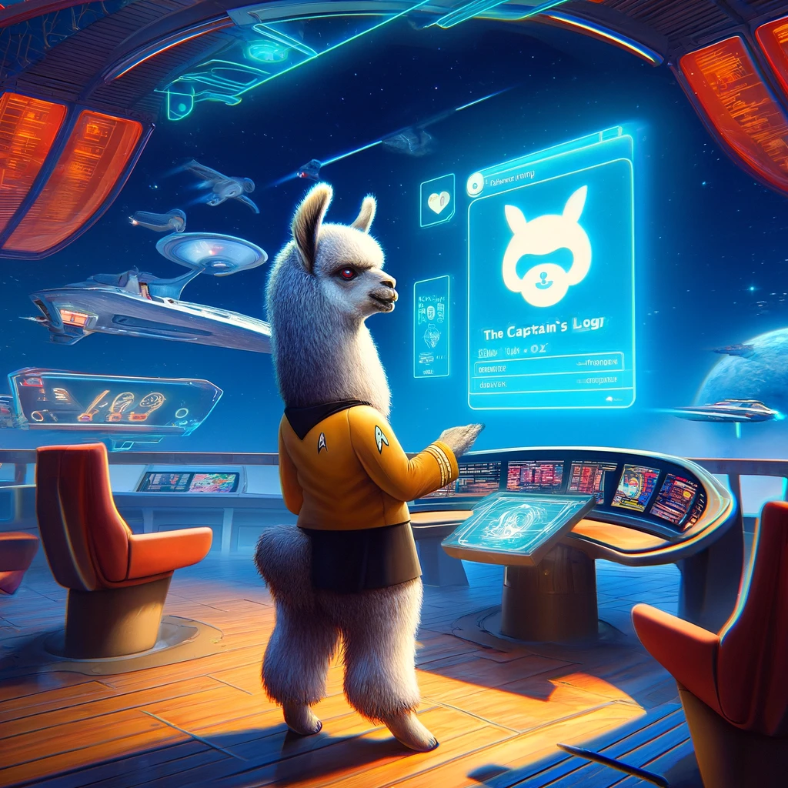

# The Captain's Log



## Overview
"The Captain's Log" is a transcription and interaction machine equipped with AI capabilities. This application captures user audio, transcribes it, analyzes the intent, and generates appropriate responses using AI models. It provides a comprehensive suite of logging functionalities to document interactions and responses effectively.

## Features
- **Audio Capture**: Dynamically records user audio when detected above a specified threshold.
- **AI-Driven Transcription and Response**: Utilizes local API endpoints to interact with Whisper and Ollama models for transcription and generating responses.
- **Interactive Logging**: Logs all interactions and responses with timestamped entries, providing a detailed account of all operations.
- **Speech Synthesis**: Converts text responses into audible speech using Silero models.

## Requirements
To run "The Captain's Log", ensure the following packages are installed:
```bash
pip install pyaudio requests watchdog pyttsx3 torchaudio omegaconf simpleaudio
```

## Setup
1. Make sure all necessary models are available at specified API endpoints for Whisper and Ollama.
2. Install all required Python libraries listed in the Requirements section.
3. Configure your audio input and output devices as per your system's hardware.

## Usage
To start the application, run the Python script after ensuring all dependencies are met and API endpoints are operational. The application will begin listening for audio and responding once it is activated.

## Log Configuration
Using the auxiliary logging tool `logger_tool.py`, logging is configured to handle various log levels and output logs to specific paths. You can customize log levels and paths as per your requirement.

## Technology Stack
- **Python**: Primary programming language.
- **PyAudio**: For capturing audio input.
- **Watchdog**: Monitoring log files for changes.
- **Requests**: Handling HTTP requests to API endpoints.
- **Torchaudio and Silero Models**: For audio processing and speech synthesis.

## Contributors
To contribute to this project, please clone the repository, make your changes, and submit a pull request.

## License
Specify the license under which your project is available. Example: MIT, GPL, etc.
